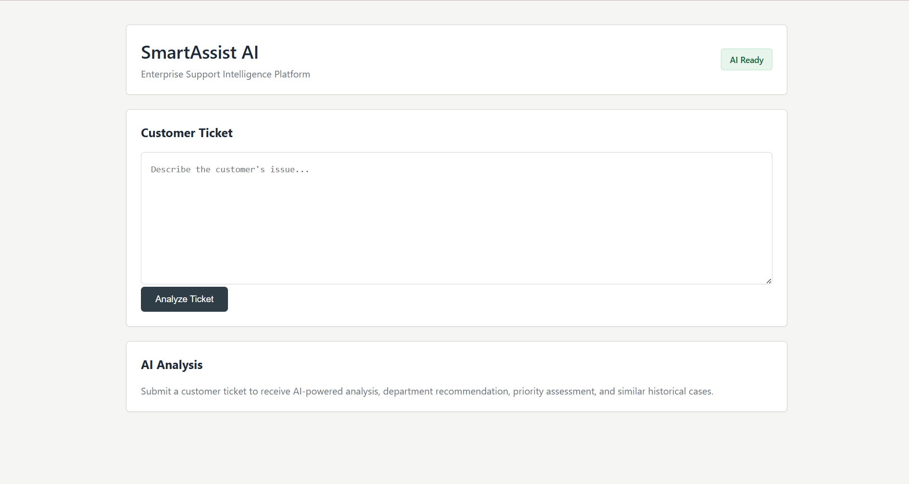
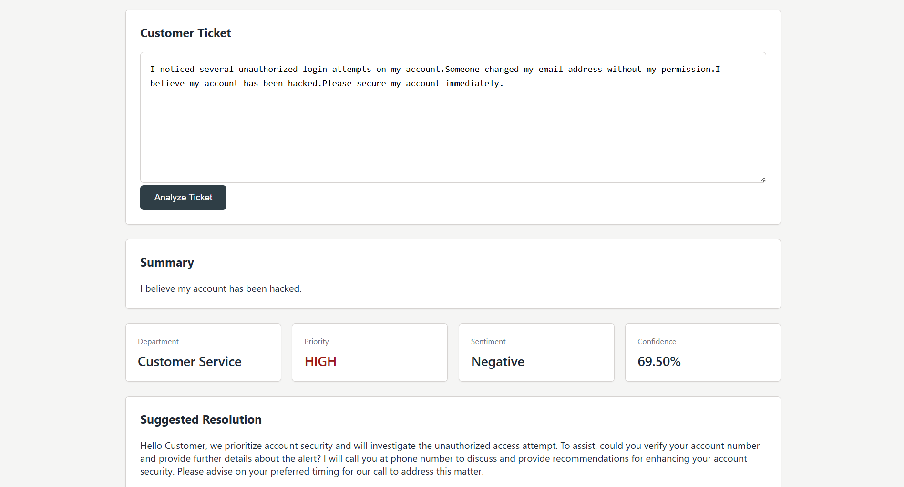

# SmartAssist AI

SmartAssist AI is an AI-powered enterprise customer support ticket analysis platform that helps support teams automatically understand and classify customer tickets. It leverages Natural Language Processing (NLP), semantic search, and machine learning to recommend the appropriate department, determine ticket priority, and retrieve similar historical tickets along with their resolutions.

---

## Features

- AI-generated ticket summary
- Sentiment analysis using Hugging Face Transformers
- Semantic similarity search using Sentence Transformers and FAISS
- Department recommendation
- Priority recommendation using a rule-based engine
- Suggested resolution based on historical tickets
- Enterprise-style React dashboard
- Spring Boot REST API
- Flask-based AI microservice

---

## System Architecture

```
                  +----------------------+
                  |    React Frontend    |
                  +----------+-----------+
                             |
                             | REST API
                             |
                  +----------v-----------+
                  | Spring Boot Backend  |
                  +----------+-----------+
                             |
                             | HTTP Request
                             |
                  +----------v-----------+
                  |  Flask AI Service    |
                  +----------+-----------+
                             |
     ---------------------------------------------------------
     |                  |                 |                   |
     |                  |                 |                   |
Sentence          Hugging Face        FAISS Index      Rule-based
Transformers      Transformers        Similarity       Priority Engine
                                       Search
```

---

## AI Pipeline

```
Customer Ticket
        │
        ▼
Ticket Summary
        │
        ▼
Sentiment Analysis
        │
        ▼
Semantic Similarity Search
        │
        ▼
Department Recommendation
        │
        ▼
Priority Recommendation
        │
        ▼
Suggested Resolution
```

---

## Tech Stack

### Frontend

- React
- Vite
- CSS

### Backend

- Spring Boot
- Java
- REST APIs

### AI Service

- Flask
- Sentence Transformers
- Hugging Face Transformers
- FAISS
- NumPy
- Pandas
- Scikit-learn

---

## Project Structure

```
SmartAssist-AI
│
├── ai-service
│   ├── app.py
│   ├── models
│   ├── services
│   ├── utils
│   └── requirements.txt
│
├── backend
│   ├── src
│   ├── pom.xml
│   └── mvnw
│
├── frontend
│   ├── src
│   ├── public
│   ├── package.json
│   └── vite.config.js
│
└── README.md
```

---

## Workflow

1. User enters a customer support ticket.
2. React sends the request to the Spring Boot backend.
3. Spring Boot forwards the request to the Flask AI service.
4. The AI service performs:
   - Ticket summarization
   - Sentiment analysis
   - Semantic similarity search
   - Department recommendation
   - Priority recommendation
   - Suggested resolution retrieval
5. The AI service returns the analysis to Spring Boot.
6. Spring Boot sends the formatted response back to the React frontend.
7. The dashboard displays the complete AI analysis.

---

## Sample Input

```json
{
  "ticket": "I noticed several unauthorized login attempts on my account. Someone changed my email address without my permission. I believe my account has been hacked. Please secure my account immediately."
}
```

---

## Sample Output

```json
{
  "summary": "I believe my account has been hacked.",
  "sentiment": "Negative",
  "sentimentConfidence": "86.21%",
  "recommendedDepartment": "Customer Service",
  "recommendedPriority": "High",
  "suggestedResolution": "Hello Customer, we prioritize account security and will investigate the unauthorized access attempt. To assist, could you verify your account number and provide further details about the alert? I will call you at phone number to discuss and provide recommendations for enhancing your account security. Please advise on your preferred timing for our call to address this matter.",
  "draftReply": "Your account has been hacked. Is there anything I can do to help?",
  "confidence": "69.50%"
}
```

---

## Running the Project

### 1. Clone the Repository

```bash
git clone https://github.com/YOUR_GITHUB_USERNAME/SmartAssist-AI.git

cd SmartAssist-AI
```

---

### 2. Start the AI Service

```bash
cd ai-service

python -m venv venv

venv\Scripts\activate

pip install -r requirements.txt

python app.py
```

Runs on:

```
http://localhost:5000
```

---

### 3. Start the Spring Boot Backend

```bash
cd backend

./mvnw spring-boot:run
```

Runs on:

```
http://localhost:8080
```

---

### 4. Start the React Frontend

```bash
cd frontend

npm install

npm run dev
```

Runs on:

```
http://localhost:5173
```

---

## Screenshots

### Home Page



---

### AI Analysis



---

## Deployment Note

The AI microservice uses transformer-based NLP models and a FAISS similarity index. Due to the memory limitations of free cloud hosting platforms, the AI service is intended to run locally for demonstration purposes. The application architecture is deployment-ready and can be hosted on cloud infrastructure with sufficient memory resources.

---

## Key Highlights

- End-to-end AI-powered customer support ticket analysis
- Microservice architecture using Spring Boot and Flask
- Semantic search using Sentence Transformers and FAISS
- AI-powered sentiment analysis using Hugging Face Transformers
- Intelligent department and priority recommendation
- Enterprise-inspired dashboard built with React

---

## Author

**Raunak Meher**

B.Tech – Computer Science and Engineering

**Tech Stack:** Java • Spring Boot • React • Python • Machine Learning • NLP
